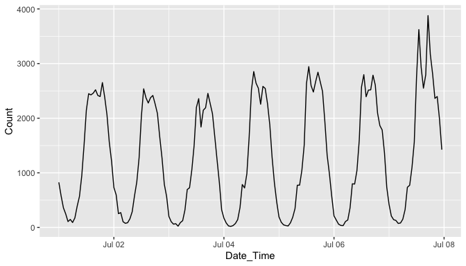
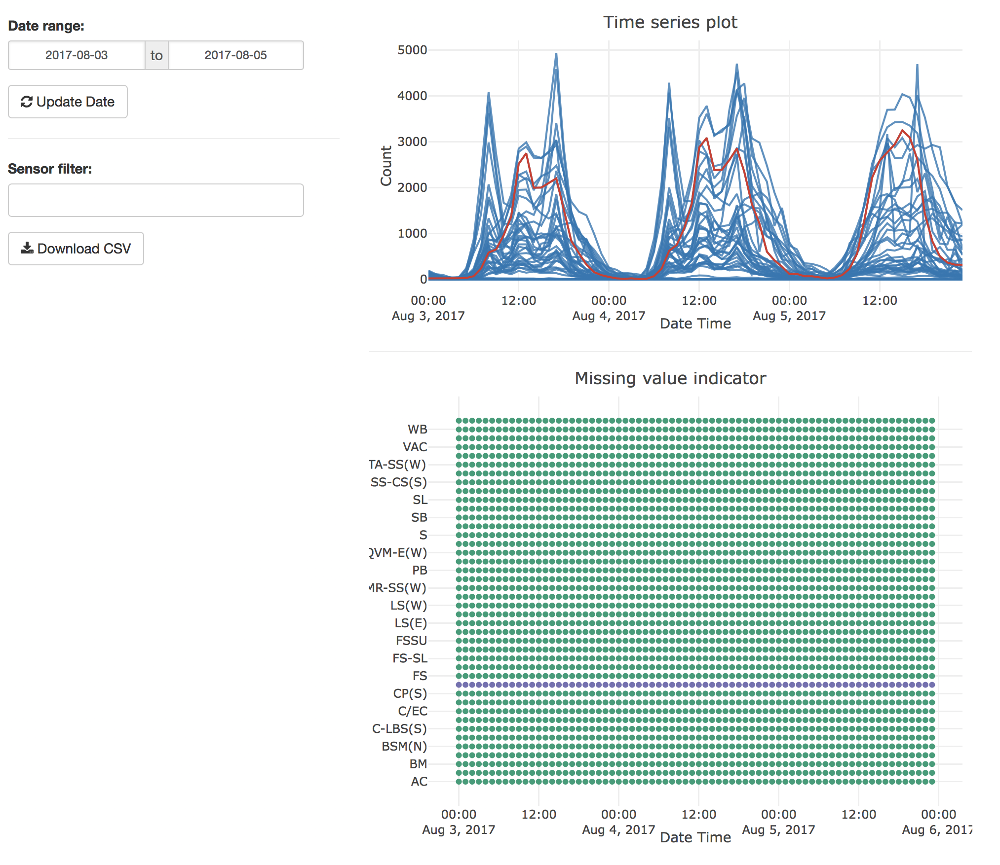

<!-- README.md is generated from README.Rmd. Please edit that file -->

[](https://travis-ci.org/earowang/rwalkr)
[](https://cran.r-project.org/package=rwalkr)
[](https://cran.r-project.org/package=rwalkr)

# rwalkr

The goal of **rwalkr** is to provide APIs to the pedestrian and
microclimate data from the City of Melbourne in tidy data form.

## Installation

You could install the stable version from CRAN:

``` r
install.packages("rwalkr")
```

You could install the development version from Github using:

``` r
# install.packages("devtools")
devtools::install_github("earowang/rwalkr")
```

## Usage

### APIs

There are two APIs available to access hourly Melbourne pedestrian data:
*compedapi* and *Socrata*. The former drives the `melb_walk()` function,
where counts are uploaded on a daily basis; the latter powers the
`melb_walk_fast()` function, where counts are uploaded on a monthly
basis. Given the function names, the function `melb_walk_fast()` pulls
the data at a much faster speed than `melb_walk()`.

The function `melb_walk()` specifies the starting and ending dates to be
pulled, whereas `melb_walk_fast()` requires years to define the time
frame. If a selection of sensors are of interest, `melb_walk_fast()`
provides the flexibility for sensor choices.

``` r
library(rwalkr)
start_date <- as.Date("2017-07-01")
ped_walk <- melb_walk(from = start_date, to = start_date + 6L)
ped_walk
#> # A tibble: 10,584 x 5
#>   Sensor                     Date_Time           Date        Time Count
#>   <chr>                      <dttm>              <date>     <int> <int>
#> 1 Bourke Street Mall (North) 2017-07-01 00:00:00 2017-07-01     0   280
#> 2 Bourke Street Mall (South) 2017-07-01 00:00:00 2017-07-01     0   177
#> 3 Melbourne Central          2017-07-01 00:00:00 2017-07-01     0   826
#> 4 Town Hall (West)           2017-07-01 00:00:00 2017-07-01     0   682
#> 5 Princes Bridge             2017-07-01 00:00:00 2017-07-01     0     0
#> # … with 10,579 more rows
ped_run <- melb_walk_fast(year = 2016:2017, sensor = NULL) # NULL means all sensors
#> downloading [=====>--------------------------------------------] 11% eta: 11s
#> downloading [=======>------------------------------------------] 17% eta: 16s
#> downloading [==========>---------------------------------------] 22% eta: 17s
#> downloading [=============>------------------------------------] 28% eta: 17s
#> downloading [================>---------------------------------] 33% eta: 17s
#> downloading [==================>-------------------------------] 39% eta: 16s
#> downloading [=====================>----------------------------] 44% eta: 15s
#> downloading [========================>-------------------------] 50% eta: 14s
#> downloading [===========================>----------------------] 56% eta: 13s
#> downloading [==============================>-------------------] 61% eta: 11s
#> downloading [================================>-----------------] 67% eta: 10s
#> downloading [===================================>--------------] 72% eta: 8s
#> downloading [======================================>-----------] 78% eta: 6s
#> downloading [=========================================>--------] 83% eta: 5s
#> downloading [===========================================>------] 89% eta: 3s
#> downloading [==============================================>---] 94% eta: 1s
#> downloading [==================================================] 100% eta: 0s
ped_run
#> # A tibble: 912,288 x 5
#>   Sensor                      Date_Time           Date        Time Count
#>   <chr>                       <dttm>              <date>     <int> <int>
#> 1 Alfred Place                2016-01-01 00:00:00 2016-01-01     0    NA
#> 2 Birrarung Marr              2016-01-01 00:00:00 2016-01-01     0  1405
#> 3 Bourke St-Russell St (West) 2016-01-01 00:00:00 2016-01-01     0  1900
#> 4 Bourke Street Mall (North)  2016-01-01 00:00:00 2016-01-01     0   461
#> 5 Bourke Street Mall (South)  2016-01-01 00:00:00 2016-01-01     0   883
#> # … with 912,283 more rows
```

There are missing values (i.e. `NA`) in the dataset. By setting
`na.rm = TRUE` in both functions, missing values will be removed.

Here’s an example to use *ggplot2* for visualisation:

``` r
library(ggplot2)
ggplot(data = subset(ped_walk, Sensor == "Melbourne Central")) +
  geom_line(aes(x = Date_Time, y = Count))
```

<!-- -->

To access minute by minute directional pedestrian counts for the last
hour, please check out the `melb_walk_directional()`.

It’s recommended to include an application token in
`melb_walk_fast(app_token = "YOUR-APP-TOKEN")`, which you can sign up
[here](https://data.melbourne.vic.gov.au/profile/app_tokens).

### Shiny app

The function `melb_shine()` launches a shiny app to give a glimpse of
the data. It provides two basic plots: one is an overlaying time series
plot, and the other is a dot plot indicating missing values. Below is a
screen-shot of the shiny app.


